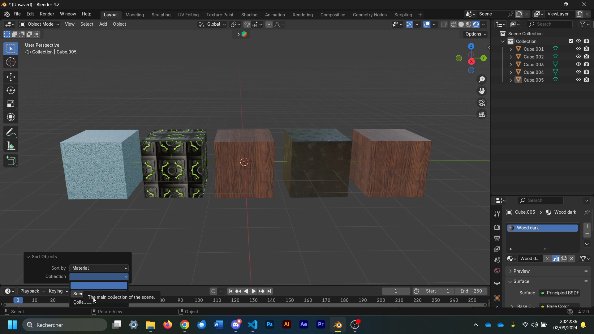

# 📜 Object Sorting Script for Blender

SortHierarchy is a script designed to sort and organize objects within a specific scene or collection based on various criteria.

## Criteria
The criteria include:
- 🔷 **Object Type (Mesh, Light, Camera, Armature, etc.)**
- 🎨 **Material**
- 📏 **Distance from the Camera**

## Usage
This script can be easily used by running the provided Python code in the "Scripting" section of Blender. After that, simply navigate to the "Object" section in the 3D viewport and click on **"Sort Objects"**.

## 🔗 Links

